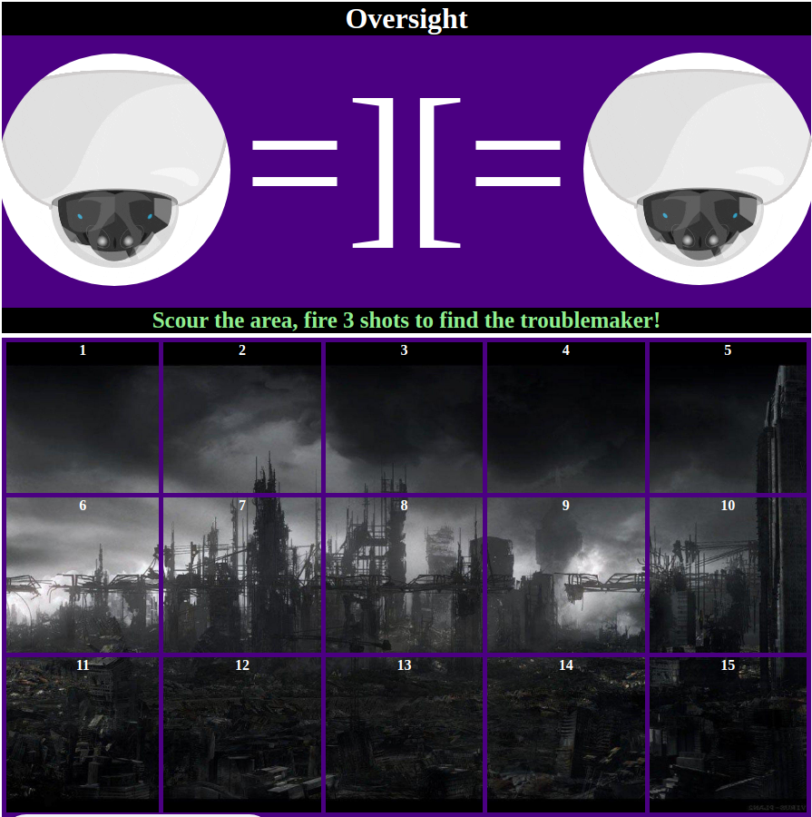

# Oversight
A game where you play as a stationary watchtower who must guess its way in searching for the troublemaker down below. Look at the hint to succeed and prevent the enemy from destroying you.

## Purpose
Oversight is a simple game project to test my capabilities in utilizing HTML, CSS, and JavaScript. I utilize the three front end languages to craft a fun and simple game experience.

## Technologies
This game utilized the front end languages of HTML, CSS, and JavaScript. It uses a variety of image and sound assets imported from other sources to create the polished aesthetic experience of the game. After forming the divs in HTML, and its organization done in CSS, the JavaScript DOM system was primarily utilized for the user interaction in the game.

## Development Approach
The code of the game is formed through a variety of functions that perform specific tasks critical for the game operation. All these functions call to each other and there is one starting function the starts game operation. I made it so that the game's many functions become operable only after certain mouse clicks occur on specific blocks. This way the game functions from a button click to button click methodology.

## Installation
Simply have all files in this repository be together and open it to a live server, if not go here: https://rolandyambao.github.io/Oversight/

## Unsolved Problems
Not really a problem, but one potential point of improvement is finding ways to make the aesthetics more dynamic, ex. an explosive animation plays upon clicking on a block.

## Code Example
~~~js
// Function for the Failure of the player
function failedMission() {
    if (turns == 6) {
        stopTyping();
        music.setAttribute("src", "defeatMusic.mp3");
        music.volume = 0.5;
        document.getElementById("title").innerHTML = "Oversight".strike();
        document.getElementById("tower").innerHTML = "&#9760;";
        backgroundBanner.style.backgroundImage = "url(fire.gif)";
        backgroundBanner.style.backgroundSize = "100% 100%";
        camera1.style.display = "none";
        camera2.style.display = "none";
        highlightWest();
        highlightCenter();
        highlightEast();
        machineVoice4Play();
        typeWriter(defeat);
        for (let i = 0; i < 15; i++) {
            hidingSpot[i].addEventListener("click", function () {
                location.reload();
            })
        }
    }
}
~~~

## Screenshot:

## Game Loop:
1. There is one player versus a computer, the player is the watchtower and the computer is the troublemaker.
2. The computer will randomly select a number between 1 to 15, each number represents a tile where the troublemaker is hiding in.
3. The Watchtower is given orders to fire three shots at any space in hope sof hitting the troublemaker.
4. After three shots, intel is given to the Watchtower telling what directional area the troublemaker is not located in.
6. After two shots, the Watchtower has one shot left, with one piece of intel stating which directional region the troublemaker is in.
7. If the Watchtower hits the troublemaker, it wins, if it misses, it loses.

## Credits
1. Command & Conquer 3: Tiberium Wars (2007) - Background Music (Gathering Intel) and Defeat Music (Mourning Hour)
2. 1984 (1984) remixed by Willard Networks - Victory Music (The Inner Party Speaker) remix name: Anthem of City Twenty-Four
3. Warhammer 40,000: Mechanicus (2020) - Machine Voices
4. SFX AND STUFF from YouTube - Cannon Sound Effect
5. Cisco Eng-emojis from Giphy - Security Camera gif
6. WallpaperAccess - Ruined City Background
7. Marco Di Lauro on Getty Images - Destroyed Building Image
8. Acegif - Fire Background on Defeat Screen
9. Adobe Stock - Red Crosshair Image

## Licensing
1. All credited content is under the Fair Use Law.
2. Code written by me is licensed under a CC-BY-NC-SA 4.0 license.
